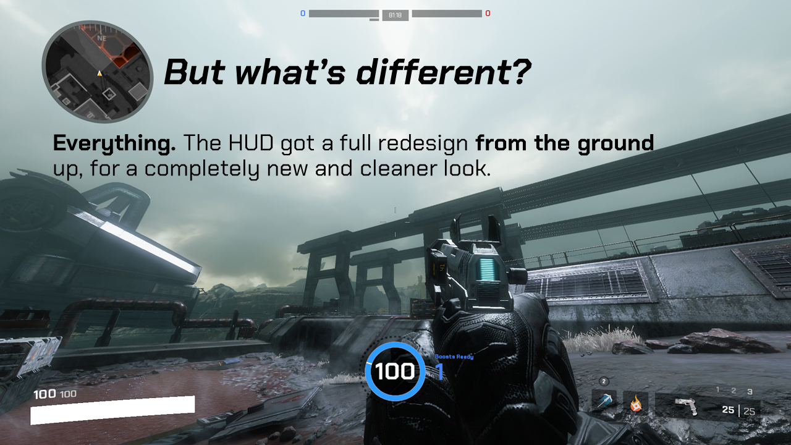
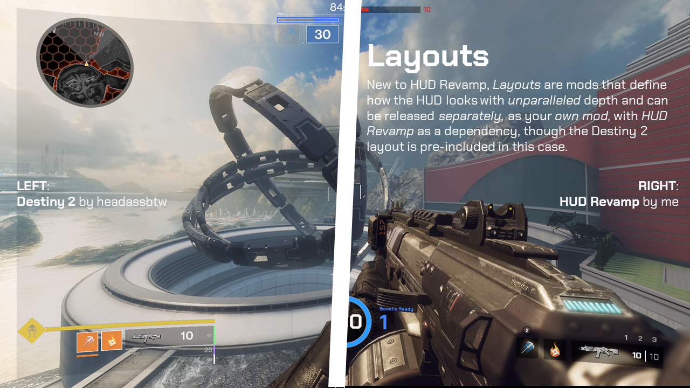
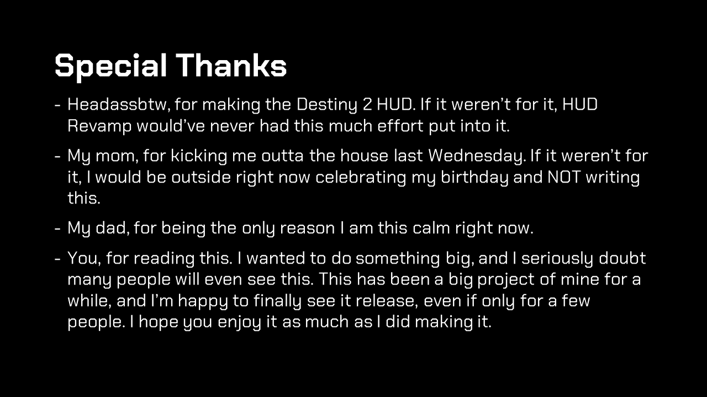

# HUDRevamp 2
The sequel to the famous and infamous HUDRevamp mod.

## But what's different?

**Everything.** The HUD got a full redesign from the ground up, for a completely new and cleaner look. See the images below for screenshots.

## Introducing: Layouts

New to HUD Revamp, Layouts are mods that define how the HUD looks with unparalleled depth and can be released separately, as your own mod, with HUD Revamp as a dependency. An example would be the Destiny 2 layout (by headassbtw), which is pre-included with the mod.

## What about HUDRevamp v1.X?

These versions are still available for download down in the version list. The old repository, though not accurate to the v1.X versions, is archived and available [here](https://github.com/EladNLG/HUDRevamp).

## Special Thanks 
- Headassbtw, for making the Destiny 2 HUD. If it weren’t for it, HUD Revamp would’ve never had this much effort put into it.
- My mom, for kicking me outta the house last Wednesday. If it weren’t for it, I would be outside right now celebrating my birthday and NOT writing this.
- My dad, for being the only reason I am this calm right now.
- You, for reading this. I wanted to do something big, and I seriously doubt many people will even see this. This has been a big project of mine for a while, and I’m happy to finally see it release, even if only for a few people. I hope you enjoy it as much as I did making it.

